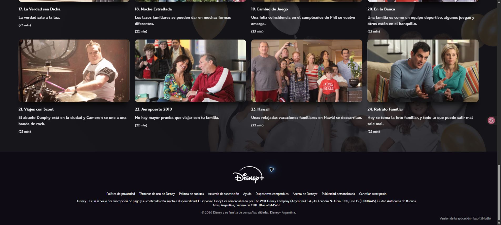

# Integración de Disney+ — 0.4.0

Inspección realizada el 8 de octubre de 2026, en Brave de escritorio, sesión del usuario, Argentina e interfaz es-419. No se obtuvo la versión exacta de Brave; no se presenta la versión histórica registrada en BRAVE.md como una comprobación actual.

## Evidencia real

- Ficha de Modern Family: 11 opciones de temporada, con identificadores publicados en el DOM.
- Temporada 11: 15 tarjetas iniciales, 18 después de recorrer la paginación.
- Temporada 1: 15 tarjetas iniciales, 24 después de recorrer la paginación. La última tarjeta fue «Retrato Familiar».
- Se abrió «Piloto» desde el enlace de la tarjeta y se comprobó que el video activo avanzaba en Brave. Se regresó a la ficha al terminar la inspección.
- La ficha expone el título mediante la imagen de cabecera; las tarjetas publican identificador, número, título, enlace y duración accesible.
- El reproductor mantiene un video oculto sin cargar y un video activo `hive-video`. El activo puede tener duración infinita; la línea de tiempo pública, dentro de shadow roots abiertos, expone una duración finita.

Estas comprobaciones usaron los controles de Disney+ y lectura del DOM. No constituyen una prueba completa de la extensión instalada ni del encadenamiento al terminar un episodio.

## Comprobación autorizada de la lista

Disney+ no expone un total verificable de episodios en los controles inspeccionados. Con autorización explícita del usuario, el adaptador desplaza el marcador `grid-pagination-spy` hacia la vista, recorre las páginas y espera tres segundos sin cambios ni estados `aria-busy` de carga. Vuelve a entrar en la zona del marcador mientras espera. La operación tiene un límite de 60 segundos por temporada y se puede cancelar.

Una página que llegue excepcionalmente tarde puede quedar fuera. La ventana avisa de esta limitación. Las barras de progreso de episodios parcialmente vistos no se consideran indicadores de carga. Si la lista se reemplaza, muestra duplicados, enlaces inválidos o cambia la ficha, se cancela el sorteo.

## Reproducción y rendimiento

El sorteo individual activa el enlace nativo y confirma el avance del video activo. El modo continuo prepara el catálogo una sola vez y conserva sus datos en `storage.session`, incluyendo la duración publicada cuando está disponible. La escucha usa eventos de video. La línea de tiempo se localiza una vez por video a través del DOM público y se consulta directamente; si no está disponible, se usa la duración de la tarjeta como referencia para los créditos. El evento `ended` confirma el final sin depender de esa duración.

Los controles manuales «VOLVER» y «VER PRÓXIMO» desactivan el modo continuo, incluidos los controles dentro de shadow roots. Se conservan los permisos y la arquitectura existentes. No se accede a APIs privadas, credenciales ni videos.

## Pruebas automatizadas

Fixtures sintéticos basados en los controles observados comprueban: origen y rutas, títulos y enlaces, duraciones con y sin segundos, lista paginada y catálogo de varias temporadas, una sola temporada, cancelación, cambio de serie o temporada, carga ocupada, progreso de visualización, doble clic, operación sin popup, video oculto, duración infinita, línea de tiempo en shadow DOM, recuperación de sesión y final duplicado. La suite conserva las regresiones de Netflix y HBO Max.

Resultado: **50 pruebas aprobadas**, comprobación de tipos y compilación correctas. El paquete generado está en `dist`, versión 0.4.0.

## Prueba manual con la extensión recargada

1. En `brave://extensions`, recargar la extensión que usa `C:\Guada\extension\dist`. Recargar Disney+ y abrir una ficha con **EPISODIOS**.
2. Comprobar el nombre y **EN DISNEY+**. Sortear en una serie de una temporada y en Modern Family; verificar que el episodio pertenece a la temporada elegida.
3. Durante la carga: cerrar el popup, hacer doble clic y cambiar de ficha. Verificar una sola operación y ausencia de resultados antiguos.
4. Volver desde el reproductor y sortear otra vez. Probar un episodio parcialmente visto y reproducción automática bloqueada.
5. Iniciar modo continuo y esperar la lectura de todas las temporadas. Cerrar el popup, volver a sortear el próximo y dejar terminar el actual. Verificar que abra exactamente el próximo mostrado, incluso si Disney+ ofrece avance nativo durante los créditos.
6. Probar pausa, búsqueda temporal, «VOLVER», «VER PRÓXIMO» y desactivación. Repetir en Chrome y comprobar Netflix/HBO Max en ambos navegadores.

Pendiente: estas pruebas completas de la extensión instalada, incluida la transición real al final del episodio. La reproducción nativa y las pruebas automatizadas no las sustituyen.
